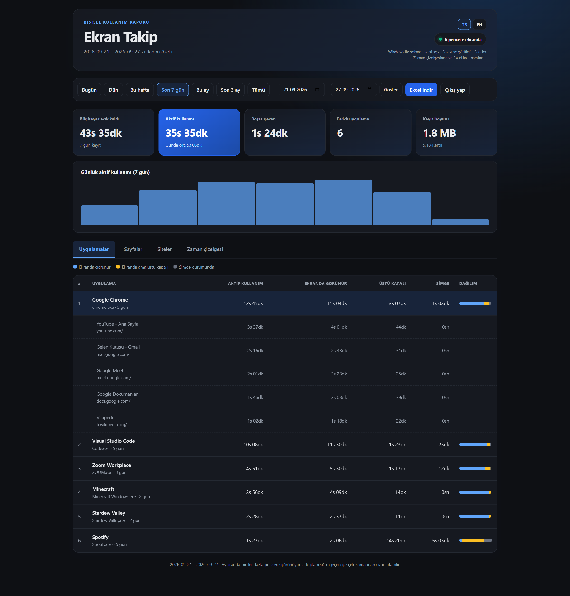
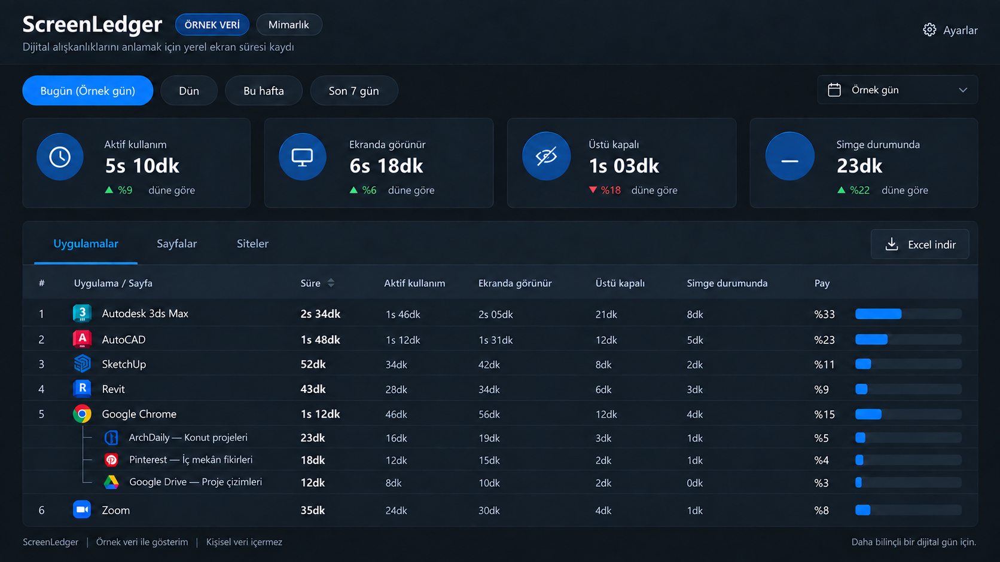
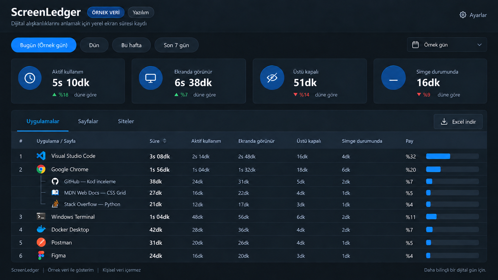
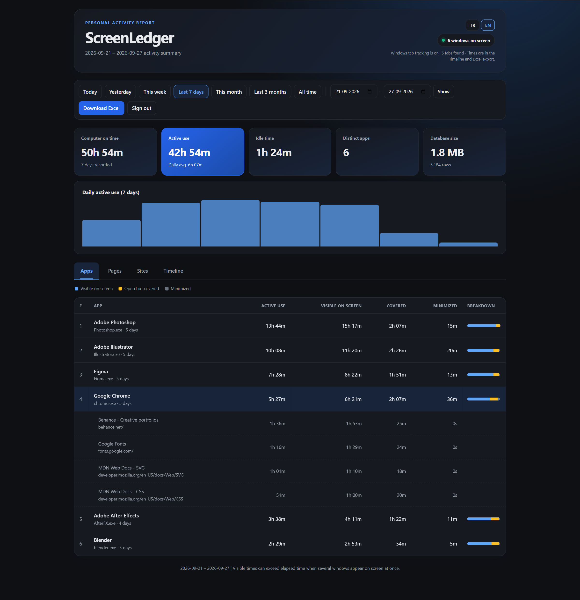

# ScreenLedger (Ekran Takip)

**A private screen-time, app-usage, and browser-tab tracker for Windows.**
**Windows için kişisel ekran süresi, uygulama ve tarayıcı sekmesi takibi.**

Understand where your computer time goes beyond daily totals: see **which apps and pages were on screen, and when**. Your records stay on your computer, and you can export a detailed Excel report for any selected date range.

Bilgisayar başında zamanınızın nereye gittiğini, yalnızca günlük toplamlarla değil, **hangi uygulamanın ve sayfanın ne zaman ekranda olduğunu** görerek anlayın. Veriler kendi bilgisayarınızda kalır; seçtiğiniz tarih aralığını ayrıntılı bir Excel dosyası olarak indirebilirsiniz.

### Preview gallery / Örnek görseller

Illustrative mockups with entirely fictional data; these are **not** captures from a running installation.

Tamamı uydurma verilerle hazırlanmış temsili görsellerdir; çalışan uygulamadan alınmış **gerçek ekran görüntüleri değildir**.

| Architecture / Mimarlık | Software / Yazılım | Design / Tasarım |
| :---: | :---: | :---: |
|  |  |  |

[🇬🇧 English](#english) · [🇹🇷 Türkçe](#turkce)

---

## 🇬🇧 English

### What is ScreenLedger?

“How long was I on my computer today?” is only the beginning. The more useful questions are **which apps, websites, and pages used that time**, and **when** they were on screen. ScreenLedger turns open Windows windows and browser tabs into a readable, local activity report.

At the end of the day, you can inspect how long an app was selected, when a meeting page appeared, and when a tab moved into the background. The timeline shows changes throughout the day instead of just one total. The report tab does not need to stay open: tracking runs separately.

This is a **personal-use** tool. It does not send your activity history to an online account or remotely monitor another computer.

### What can you see?

- **Apps:** Time spent selected, visible on screen, covered by other windows, or minimized.
- **Pages and websites:** Time associated with browser pages and sites. When available, tab switches and background-tab periods are included.
- **Timeline:** When an app or tab changed state, so you can answer “at what times?” rather than seeing only a daily total.
- **Date ranges:** Today, yesterday, this calendar week (starting Monday), the last seven days, this month, the last three months, all recorded time, or your own date range.
- **Detailed Excel export:** App totals, pages within apps, daily/hourly detail, tab times, and a detailed timeline are organized into separate worksheets for the selected period.
- **Interface languages:** Use **TR / EN** at the top right of the report or sign-in page to switch between Turkish and English. The choice is remembered in that browser. Activity records are not changed by switching languages.

### Quick start

**Requirements:** A 64-bit Windows computer. The downloadable installer includes its own Python runtime; you do **not** need to install Python, run a terminal, or have administrator rights.

1. Open the [latest release](https://github.com/eraybilgin/ScreenLedger/releases/latest) and download its `ScreenLedger-Setup-*.exe` installer. Use the **Releases** download, not **Code → Download ZIP**; the ZIP contains source code, not the ready-to-run installer.
2. Run the installer. Leave **Start tracking when I sign in to Windows** selected if you want automatic tracking after each sign-in. The installer places program files under your Windows user profile, without requesting administrator access.
3. At the end, select **Open ScreenLedger report**, or use **Start menu → ScreenLedger** later. The report opens at `http://127.0.0.1:8777/`. On first use, set a non-empty report password and keep it somewhere safe.
4. Browse **Apps**, **Pages**, **Sites**, and the time detail; choose a date range and use **Download Excel** to save the detailed report. Closing the browser tab does not stop tracking.

The optional startup shortcut starts tracking **after you sign in to your Windows account**, not before login. If you did not select it, opening ScreenLedger from the Start menu starts tracking and opens the report. The installer is not currently code-signed, so Windows may show a publisher/reputation warning. Only run files obtained from this project's Releases page; inspect the source if in doubt.

If the report does not open, check `%LOCALAPPDATA%\ScreenLedger\logs\calisma.log` and `hatalar.log` for the installed version. Redact personal paths and visited URLs before sharing logs in a bug report.

**From source (developers or advanced users):** Download the repository with **Code → Download ZIP** into a permanent, writable folder. Install [Python 3.11 or newer](https://www.python.org/downloads/windows/), then double-click `kur.bat`. This installs dependencies locally, starts tracking, and configures sign-in startup. Use `raporu-ac.bat` to open its existing report; `kaldir.bat` safely stops it and removes source-mode startup. Do not run source mode and the installed version together.

### Understanding the time categories

| Report label | Meaning |
| --- | --- |
| Active use (`Aktif kullanım`) | Time for the selected window. It does **not** require a mouse or keyboard action every second. |
| Visible (`Ekranda görünür`) | Time the window is visible on screen. Multiple windows can be visible at once. |
| Covered (`Üstü kapalı`) | The window is open but behind other windows or outside the visible area. |
| Minimized (`Simge durumunda`) | The window is minimized to the taskbar. |
| Idle (`Boşta`) | Counting stops after an extended period without keyboard, mouse, or screen movement. Locked and sleeping time is not counted. |

**Important:** Visible-time totals can exceed elapsed wall-clock time because several windows may be visible together. A moving video usually prevents the computer from being considered idle; that does not necessarily mean you were actively working.

### Browser tabs

Without an extension, ScreenLedger can read Chrome and Edge tab information exposed through Windows window/accessibility interfaces. Some browser states do not expose every tab switch or the full address of a background tab that has never been selected.

For more precise tab-created, tab-selected, and tab-closed events, you can install the **optional** browser extension. In the installed version it is at `%LOCALAPPDATA%\ScreenLedger\sekme-eklentisi`; in source mode it is in the repository's `sekme-eklentisi` folder. Run the main app once first so it creates this computer's local connection settings. Then open Chrome or Edge extension management, enable **Developer mode**, choose **Load unpacked**, and select that folder. The extension sends events only to the app running on your computer. It deliberately does not track incognito windows.

The extension-free Windows reader may still see incognito window titles if the browser exposes them. Do not assume private browsing is entirely excluded from recording. Events that happened while the browser or tracker was not running cannot be perfectly reconstructed later.

### Privacy and your data

- The report server listens only at `127.0.0.1:8777` **on your computer**. Activity records are not uploaded to a cloud account.
- Installed-version records are stored in `%LOCALAPPDATA%\ScreenLedger\data\veri.db`, **separate from program files**. Source-mode records remain in the source folder's `data` directory (or its older root-level files). While the app runs, `veri.db-wal` and `veri.db-shm` helper files may also exist. Do not delete them while tracking is running.
- `%LOCALAPPDATA%\ScreenLedger\data\kimlik.json` stores a salted password verifier, not your plaintext password. The report password **does not encrypt the database**: another user or program with access to the file can read it separately.
- The optional extension's local connection key is in the extension folder's `ayar.json`. Do not share that file or logs.
- Page titles and URLs can contain private meeting or account links. Review exported Excel files before sharing them.
- A tiny sample of the screen is compared to detect motion; screenshots are not saved to disk.

There is no email-based password recovery. Removing `kimlik.json` from the relevant data folder allows a new password to be set without deleting the activity history in `veri.db`. This is why operating-system file permissions still matter.

### Backup, updates, and removal

**Backup (installed version):** Use `ScreenLedger.exe --stop` from its program folder before manually copying data. Copy `%LOCALAPPDATA%\ScreenLedger\data\veri.db` and `kimlik.json` to a secure location. Also back up `%LOCALAPPDATA%\ScreenLedger\sekme-eklentisi\ayar.json` if you use the optional extension. Copying only the main database while tracking runs may omit recent records. Start ScreenLedger from the Start menu when you are done.

**Update (installed version):** Make a backup first, then run the newer installer. It asks the running copy to finish writing and close before replacing program files. The data folder is outside the installation folder and is not overwritten. If safe shutdown fails, installation stops instead of forcing it. Your startup choice is kept by the installer.

**Moving from an earlier source/ZIP installation:** In the old folder run `kaldir.bat` and confirm shutdown. Back up its `data\veri.db` and `data\kimlik.json` (or root-level files on very old versions). Before launching the new installation, copy those two files into `%LOCALAPPDATA%\ScreenLedger\data\` (create the directory if needed). Install and launch ScreenLedger. Do not run the old source copy at the same time. For the optional extension, load `%LOCALAPPDATA%\ScreenLedger\sekme-eklentisi` again after the new app has generated its connection file.

**Remove:** Use **Windows Settings → Installed apps → ScreenLedger → Uninstall**. It stops tracking and removes program files and the sign-in shortcut. Personal records in `%LOCALAPPDATA%\ScreenLedger\data\` and logs are intentionally **kept**. Back them up before manually deleting that folder if you truly want to erase your history. Source-mode users can use `kaldir.bat`; it does not delete their records either.

### Resource use

ScreenLedger runs one background tracker and a local report server. It checks windows about every **two seconds** and normally writes accumulated timing data about **once per minute**. A smoke test of the bundled Windows executable on one computer showed approximately **50 MB of working memory** while tracking; the bundled program files were about **21 MB** and the compressed installer about **10 MB**. These are observations, **not guaranteed limits**. CPU use, memory, and database size vary with the number of windows and tabs, browser accessibility behavior, how long you collect data, and how often you export reports. Opening a large report or exporting Excel can temporarily use substantially more memory and CPU. Stored history grows over time; the app does not promise a fixed database size. Watch Task Manager on your own computer if resource use matters to you.

### Technical details

This section is for people who want to inspect or develop the source code.

- The tracker samples open windows about **every two seconds**. State-change times are therefore approximate. Sleep or an unexpected shutdown may leave the exact end time unknown.
- When keyboard/mouse input stops, screen motion is checked periodically too. The computer is considered idle after roughly **ten minutes** without detected activity. Sampling and idle thresholds are defined near the top of `app/takip.py`.
- Records live in a local SQLite database. The report is served by a local browser interface; `openpyxl` creates Excel files, and `comtypes` reads Windows accessibility information. Dependencies are listed in `requirements.txt`; the release build uses `PyInstaller` and `Inno Setup` (see `packaging`).
- Folders: `app` (application code), `data` (private records), `logs` (runtime logs), `backups` (local backups), and `sekme-eklentisi` (optional browser integration). The root `takip.py` is a stable startup entry point; the sampling loop is in `app/takip.py`. `kur.py` manages setup and automatic startup.
- Other operating systems have not been tested.

**Known limits:** Window occlusion is estimated with rectangles, so transparent or unusual windows can differ from what you perceive. Some fullscreen games do not expose a window title. Browsers vary in how much tab information they expose through Windows.

**Before making the repository public:** `.gitignore` is intended to exclude local records, logs, password/extension settings, and the working environment from source control. Still inspect the actual files you are about to upload: ignore rules do not retroactively remove files that were already added.

---

## 🇹🇷 Türkçe

### Ekran Takip ne işe yarar?

“Bugün bilgisayarı kaç saat kullandım?” sorusu çoğu zaman yeterli değildir. Asıl merak edilen, bu sürenin **hangi uygulamalara, sitelere ve sayfalara dağıldığıdır**. Ekran Takip, Windows bilgisayarınızda açık pencereleri ve tarayıcı sekmelerini izleyerek bunu anlaşılır bir rapora dönüştürür.

Örneğin gün sonunda bir uygulamanın ne kadar süre seçili kaldığını, bir toplantı sayfasının hangi saatlerde göründüğünü veya bir sekmenin ne zaman arka plana geçtiğini inceleyebilirsiniz. Zaman çizelgesi, tek bir toplam yerine gün içindeki değişimi gösterir. Tarayıcıdaki rapor sekmesini açık tutmanız gerekmez; takip ayrı bir program olarak çalışır.

Bu proje **kişisel kullanım** içindir. Kayıtları çevrimiçi bir hesaba göndermez ve başka birinin bilgisayarını uzaktan izlemez.

### Neler görebilirsiniz?

- **Uygulamalar:** Hangi program ne kadar kullanılmış, ekranda görünmüş, başka pencerelerin altında kalmış veya simge durumuna küçültülmüş?
- **Sayfalar ve siteler:** Tarayıcıda hangi sayfa ve site ne kadar süreyle görülmüş? Desteklenen durumlarda sekmeler arası geçiş ve arka planda kalma süreleri de gösterilir.
- **Zaman çizelgesi:** Uygulama veya sekmenin durumunun gün içinde ne zaman değiştiği. Böylece yalnızca “2 saat” değil, “hangi saat aralıklarında?” sorusuna da bakabilirsiniz.
- **Esnek tarihler:** Bugün, dün, pazartesiden başlayan bu hafta, son yedi gün, bu ay, son üç ay, tüm kayıtlar veya seçtiğiniz iki tarih.
- **Ayrıntılı Excel indirmesi:** Seçilen aralık için uygulama toplamları, uygulama içindeki sayfalar, gün ve saat ayrıntıları, sekme saatleri ve zaman çizelgesi ayrı çalışma sayfalarında yer alır.
- **Arayüz dili:** Raporun veya giriş ekranının sağ üstündeki **TR / EN** düğmelerinden Türkçe ile İngilizce arasında geçiş yapabilirsiniz. Seçim o tarayıcıda hatırlanır; dil değişikliği kullanım kayıtlarını değiştirmez.

### Hızlı başlangıç

**Gerekenler:** 64 bit Windows bilgisayar. Hazır kurulum paketi Python çalışma ortamını içerir; ayrıca Python kurmanız, komut yazmanız veya yönetici izni vermeniz gerekmez.

1. [En yeni sürüm sayfasını](https://github.com/eraybilgin/ScreenLedger/releases/latest) açıp oradaki `ScreenLedger-Setup-*.exe` kurulum dosyasını indirin. **Releases/Sürümler** bölümündeki kurulum dosyasını seçin; **Code → Download ZIP** hazır kurulum değil, kaynak kodudur.
2. Kurulum dosyasını çalıştırın. Windows hesabınıza her girişte takibin kendiliğinden başlamasını istiyorsanız **Windows oturumu açıldığında takibi başlat** seçeneğini açık bırakın. Kurulum yönetici izni istemez ve program dosyalarını kendi kullanıcı alanınıza yerleştirir.
3. Kurulum sonunda **ScreenLedger raporunu aç** seçeneğini işaretleyin veya daha sonra **Başlat menüsü → ScreenLedger** yolunu kullanın. Rapor `http://127.0.0.1:8777/` adresinde açılır. İlk girişte boş olmayan bir rapor şifresi belirleyip güvenli yerde saklayın.
4. **Uygulamalar**, **Sayfalar**, **Siteler** ve saat ayrıntılarını inceleyin; tarih seçip **Excel indir** ile ayrıntılı kayıtları alın. Tarayıcıdaki rapor sekmesini kapatmak takibi durdurmaz.

Otomatik başlama seçeneği açıksa takip **Windows hesabınızla oturum açtıktan sonra** başlar; oturum açılmadan önce çalışmaz. Bu seçeneği kapatırsanız Başlat menüsünden ScreenLedger'ı açmak takibi de başlatır. Kurulum dosyası henüz dijital olarak imzalı değildir; Windows, yayımcı/güvenilirlik uyarısı gösterebilir. Dosyayı yalnızca bu projenin Sürümler sayfasından indirin; emin değilseniz kaynak kodunu inceleyin.

Rapor açılmıyorsa kurulu sürümün `%LOCALAPPDATA%\ScreenLedger\logs\calisma.log` ve `hatalar.log` dosyalarını kontrol edin. Hata bildirirken kişisel yolları ve ziyaret ettiğiniz adresleri gizleyin.

**Kaynak kodundan kurulum (geliştiriciler veya ileri düzey kullanıcılar):** Depoyu **Code → Download ZIP** ile kalıcı ve yazılabilir bir klasöre çıkarın. [Python 3.11 veya daha yeni sürümü](https://www.python.org/downloads/windows/) yükleyip `kur.bat` dosyasını çalıştırın. Bu yöntem gerekli parçaları ayrı bir ortama kurar, takibi başlatır ve oturum açılışına ekler. `raporu-ac.bat` mevcut raporu açar; `kaldir.bat` kaynak sürümünü güvenle kapatır ve otomatik açılışı kaldırır. Kaynak sürümü ve kurulu sürümü aynı anda çalıştırmayın.

### Süreler nasıl okunur?

| Rapordaki ad | Anlamı |
| --- | --- |
| Aktif kullanım | O anda seçili olan pencerenin süresi. Her saniye fare veya klavye hareketi yapmanız gerekmez. |
| Ekranda görünür | Pencerenin ekranda görüldüğü süre. Birden fazla pencere aynı anda görünüyorsa hepsine süre yazılabilir. |
| Üstü kapalı | Pencere açıktır, fakat başka pencerelerin altında veya ekranın dışında kalmıştır. |
| Simge durumunda | Pencere görev çubuğuna küçültülmüştür. |
| Boşta | Uzun süre klavye, fare veya ekran hareketi algılanmazsa kullanım sayımı durur. Kilitli veya uyuyan bilgisayarda süre sayılmaz. |

**Önemli:** Görünür pencere sürelerinin toplamı, aynı anda birden fazla pencere görülebildiği için geçen gerçek zamandan büyük olabilir. Hareketli video genellikle bilgisayarın boşta sayılmasını önler; bu, videonun başında aktif olarak çalıştığınız anlamına gelmez.

### Tarayıcı sekmeleri

Ekran Takip, Chrome ve Edge sekmelerini Windows'un sağladığı pencere/erişilebilirlik bilgileri üzerinden **eklentisiz** okuyabilir. Bu yöntem bazı tarayıcı durumlarında sekme geçişlerini veya hiç seçilmemiş arka plan sekmelerinin tam adreslerini gösteremeyebilir.

Daha kesin oluşturulma, seçilme ve kapanma bilgisi isterseniz **isteğe bağlı** tarayıcı eklentisini kurabilirsiniz. Kurulu sürümde eklenti `%LOCALAPPDATA%\ScreenLedger\sekme-eklentisi`, kaynak sürümünde depo içindeki `sekme-eklentisi` klasöründedir. Önce ana uygulamayı bir kez çalıştırın; bu bilgisayara ait bağlantı ayarı otomatik oluşur. Ardından Chrome veya Edge eklenti yönetiminde **Geliştirici modu → Paketlenmemiş öğe yükle** seçeneğiyle ilgili klasörü seçin. Eklenti bilgileri yalnızca bilgisayarınızdaki uygulamaya iletir; gizli pencereleri bilerek izlemez.

Eklenti olmadan kullanılan Windows okuması, tarayıcı görünür hâle getiriyorsa gizli pencere başlıklarını okuyabilir. Gizli gezinmenin hiçbir şekilde kaydedilmediğini varsaymayın. Tarayıcı kapalıyken veya takip çalışmıyorken gerçekleşen olaylar sonradan eksiksiz oluşturulamaz.

### Gizlilik ve verileriniz

- Rapor sayfası yalnızca **bu bilgisayarda** `127.0.0.1:8777` adresinde dinler. Uygulama kayıtlarınızı bulut hesabına göndermez.
- Kurulu sürümün kayıtları, program dosyalarından ayrı olarak `%LOCALAPPDATA%\ScreenLedger\data\veri.db` dosyasında tutulur. Kaynak sürümündeki kayıtlar kaynak klasörünün `data` altında (çok eski kurulumlarda doğrudan kökte) kalır. Çalışırken `veri.db-wal` ve `veri.db-shm` yardımcı dosyaları oluşabilir; program açıkken silmeyin.
- `%LOCALAPPDATA%\ScreenLedger\data\kimlik.json` şifrenizin açık metnini değil, doğrulamada kullanılan tuzlu özetini saklar. Rapor şifresi **veritabanını şifrelemez**: kayıt dosyasına erişebilen başka bir kullanıcı veya program içeriğini ayrıca okuyabilir.
- İsteğe bağlı eklentinin yerel bağlantı anahtarı eklenti klasöründeki `ayar.json` dosyasındadır. Bu dosyayı veya günlükleri paylaşmayın.
- Ziyaret edilen sayfaların başlıkları ve adresleri özel toplantı ya da hesap bağlantıları içerebilir. İndirdiğiniz Excel dosyalarını paylaşmadan önce gözden geçirin.
- Ekrandaki hareketi anlamak için görüntünün çok küçük bir örneği karşılaştırılır; ekran görüntüsü dosyaya kaydedilmez.

Şifreyi unutursanız e-posta ile kurtarma yoktur. İlgili kayıt klasöründeki `kimlik.json` dosyasını kaldırmak yeni şifre oluşturma ekranını açar ve `veri.db` içindeki kullanım kayıtlarını silmez. Bu nedenle bilgisayardaki dosya erişim izinleri önemlidir.

### Yedekleme, güncelleme ve kaldırma

**Yedekleme (kurulu sürüm):** Elle kopyalamadan önce kurulum klasöründeki `ScreenLedger.exe --stop` komutuyla takibi güvenle durdurun. `%LOCALAPPDATA%\ScreenLedger\data\veri.db` ve `kimlik.json` dosyalarını güvenli bir yere kopyalayın. İsteğe bağlı eklentiyi kullanıyorsanız `%LOCALAPPDATA%\ScreenLedger\sekme-eklentisi\ayar.json` dosyasını da yedekleyin. Takip çalışırken yalnızca ana veritabanı dosyasını kopyalamak son kayıtları kaçırabilir. Bitince Başlat menüsünden ScreenLedger'ı açın.

**Güncelleme (kurulu sürüm):** Önce yedek alın, sonra yeni kurulum dosyasını çalıştırın. Kurulum çalışan kopyanın kayıtlarını tamamlayarak kapanmasını ister ve ardından yalnızca program dosyalarını değiştirir. Kişisel kayıt klasörüne dokunmaz. Güvenli kapanış başarısızsa veri kaybı riskine girmemek için kurulum durur. Oturum açılışı seçiminiz korunur.

**Eski kaynak/ZIP kurulumundan geçiş:** Eski klasörde `kaldir.bat` dosyasını çalıştırıp kapanışı doğrulayın. `data\veri.db` ve `data\kimlik.json` dosyalarını (çok eski sürümde doğrudan kökteki dosyaları) yedekleyin. Yeni kurulu sürümü başlatmadan önce bu iki dosyayı `%LOCALAPPDATA%\ScreenLedger\data\` içine kopyalayın; klasör yoksa oluşturun. Ardından yeni sürümü kurup açın. Eski kaynak kopyasını aynı anda çalıştırmayın. İsteğe bağlı eklenti için `%LOCALAPPDATA%\ScreenLedger\sekme-eklentisi` klasörünü, yeni bağlantı ayarı oluşunca tarayıcıya yeniden yükleyin.

**Kaldırma:** **Windows Ayarları → Yüklü uygulamalar → ScreenLedger → Kaldır** yolunu kullanın. Takip durur; program dosyaları ve oturum açılışındaki kısayol kaldırılır. `%LOCALAPPDATA%\ScreenLedger\data\` içindeki kişisel kayıtlar ve günlükler **bilerek saklanır**. Geçmişi tamamen silmek istiyorsanız önce yedekleyip o klasörü ayrıca elle kaldırın. Kaynak sürümünü kullananlar `kaldir.bat` dosyasını kullanabilir; bu da kayıtlarını silmez.

### Kaynak tüketimi

ScreenLedger, arka planda bir takip programı ve yalnızca bu bilgisayarda çalışan bir rapor sayfası kullanır. Açık pencereleri yaklaşık **iki saniyede bir** ölçer; biriken süreleri normalde yaklaşık **dakikada bir** diske yazar. Paketlenmiş sürümün bir bilgisayarda yapılan kısa denemesinde yaklaşık **50 MB çalışma belleği** görüldü; program dosyaları yaklaşık **21 MB**, sıkıştırılmış kurulum dosyası yaklaşık **10 MB** idi. Bunlar **üst sınır veya her bilgisayarda geçerli bir garanti değildir**. Açık pencere/sekme sayısı, tarayıcının bilgi sunma biçimi, ne kadar süre kayıt tutulduğu ve raporların büyüklüğü işlemciyi, belleği ve depolamayı etkiler. Büyük raporu açarken veya Excel çıktısı alırken bellek ve işlemci kullanımı geçici olarak çok daha yüksek olabilir. Veritabanı zamanla büyür; sabit boyut sözü verilmiyor. Sizin bilgisayarınızda etkisini görmek için Görev Yöneticisi'nden izleyin.

### Teknik ayrıntılar

Bu bölüm, kaynak kodunu incelemek veya geliştirmek isteyenler içindir.

- Takip programı yaklaşık **iki saniyede bir** açık pencereleri ölçer. Kısa aralıklı durum değişimlerinin saatleri bu yüzden yaklaşık olabilir. Uyku veya beklenmedik kapanış sırasında kesin bitiş saati bilinemeyebilir.
- Klavye/fare hareketi yokken ekrandaki hareket de aralıklarla denetlenir. Yaklaşık **on dakika** boyunca etkinlik algılanmazsa bilgisayar boşta sayılır. Ölçüm aralığı ve eşikler `app/takip.py` dosyasının başındaki ayarlardır.
- Kayıtlar yerel bir SQLite veritabanında tutulur. Rapor için tarayıcıda çalışan yerel bir arayüz, Excel çıktısı için `openpyxl`, Windows erişilebilirlik okuması için `comtypes` kullanılır. Paket listesi `requirements.txt` dosyasındadır; yayımlanan kurulum `PyInstaller` ve `Inno Setup` ile hazırlanır (`packaging` klasörü).
- Klasörler: `app` (uygulama kodu), `data` (kişisel kayıtlar), `logs` (çalışma günlükleri), `backups` (yerel yedekler), `sekme-eklentisi` (isteğe bağlı tarayıcı desteği). Üstteki `takip.py` otomatik başlangıcın sabit girişidir; ölçüm döngüsü `app/takip.py` içindedir. `kur.py` kurulum ve otomatik açılışı yönetir.
- Proje diğer işletim sistemlerinde denenmemiştir.

**Bilinen sınırlar:** Pencere örtüşmesi dikdörtgen alanlar üzerinden yaklaşık hesaplanır; şeffaf veya alışılmadık pencerelerde sapma olabilir. Bazı tam ekran oyunlar pencere başlığını sağlamaz. Her tarayıcı, sekme bilgisini Windows üzerinden aynı ayrıntıda sunmaz.

**Herkese açık paylaşım notu:** `.gitignore` yerel kayıtları, günlükleri, şifre/eklenti ayarlarını ve çalışma ortamını kaynak kodu paketinin dışında tutmak için hazırlanmıştır. Yine de GitHub'a dosya göndermeden önce gönderilecek dosyaları elle kontrol edin; bu liste önceden eklenmiş dosyaları geriye dönük olarak kaldırmaz.
